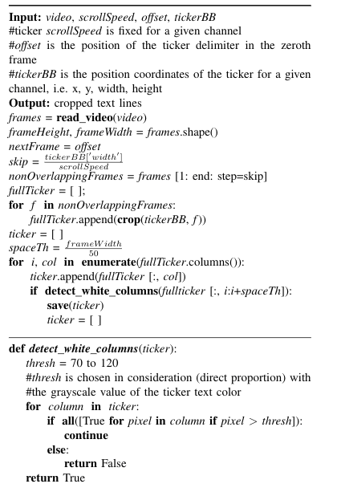
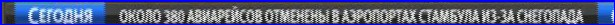
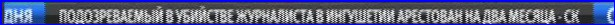
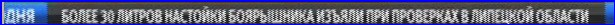

## Week 1 — Google Summer of Code 2018

Now the first week has started, I started to work on various aspects of the project. I started to research more on Scrolling Ticker Algorithm and also started did some other work which are as follows

### CWRU HPC Accounts
Every student working under Red Hen Labs is given a CWRU Account for High Performance Computing (HPC) which does the training of a model more speedily than a ordinary laptop. Our administrator Mark Turner asked some of the credentials and our RSA public keys. 
Our accounts had been made in a single day and also our credentials were given to login into CWRU cluster to work on.


```markdown

burhantwo@Burhan-Ubuntu:~$ ssh bxu22@redhen1.case.edu
Last login: Sun May 27 09:18:00 2018 from 103.255.7.30
bxu22@redhen1:~$ ssh bxu22@rider.case.edu
Last login: Sat May 19 06:53:44 2018 from redhen1.cosi.cwru.edu
[bxu22@hpc3 ~]$

```


### Problem and Installations
To solve the scrolling ticker problem, I used a modification of early fusion algorithm, basically what an early fusion algorithm does is, it check for changes in a ticker and a stopping point (which tells that one news has been finished and other has been started), if the changes are above some threshold value, it appends the ticker to a blank ticker otherwise it lets it go, it is very simple but powerful algorithm which can easily detect the changes in a ticker with upto 90% accuracy, to do the early fusion algorithm, I started needed to install OPENCV which is an open source Computer Vision Library. I needed to install OPENCV from source rather than install its pip version because pip version doesn’t support Video processing, so what I did was

```markdown
wget -O opencv.zip https://github.com/Itseez/opencv/archive/3.1.0.zip
unzip opencv.zip
```

This downloads OPENCV 3.1.0 and unzips it

Next I did was,

```markdown
wget -O opencv_contrib.zip https://github.com/Itseez/opencv_contrib/archive/3.1.0.zip
unzip opencv_contrib.zip
```

This downloads the extra modules associated with OPENCV 3.1.0 and unzips it. Next I installed Numpy

```markdown
pip install numpy
```
Finally, I installed OPENCV as

```markdown
cd ~/opencv-3.1.0/
mkdir build
cd build
cmake -D CMAKE_BUILD_TYPE=RELEASE \
-D CMAKE_INSTALL_PREFIX=/usr/local \
-D OPENCV_EXTRA_MODULES_PATH=~/opencv_contrib-3.1.0/modules \
-D BUILD_EXAMPLES=ON ..
make -j3 
sudo make install
sudo ldconfig
```

Now as OPENCV is installed, I’ll start working on implementing Scrolling Ticker Algorithm (Early Fusion Recognition) next week

Till Then

Cheers!!!!

## Google Summer of Code 2018 — Week 2

Now, I’m ending the week 2 of Google Summer of Code for Red Hen Labs, I’ll be writing my experiences and what I’ve done so far.

### Scrolling Ticker Algorithm (Early Fusion Recognition):

I had proposed Scrolling Ticker Algorithm (Early Fusion Recognition) as follows:




This algorithm checks for threshold and a stopper (which tells that a new news ticker has started), while taking in various inputs like ticker width, height, offset and speed, it then checks for threshold and if the ticker text is greater than that threshold (taken as 70), it appends that ticker to new ticker. With that we can easily detect different scrolling news with upto 90% accuracy. Nonetheless it also requires manual intervention because it takes various frames of same ticker and we have to manually specify which frame is most appropriate.

Since we don’t have the detector to detect Russian Text, I used the ticker co-ordinates to hard code the bounding box over the video region. I did so by

```markdown
cv2.rectangle(frame, (100, 525), (715, 550), (255,0,0), 2)
```

where frame is the exact video frame, x1 = 100, y1 = 525, x2 = 715 and y2 = 550.

After hardcoding the region and running the Scrolling Ticker Algorithm (Early Fusion), I got amazing results, some of which are








Since we are getting good results here, I’ll now rewrite the whole code in C as instructed to me by my mentor.

So next week, I’ll start working on writing its C code and also on integrating Tesseract API with Leptonica in it.

Until then

Cheers.


