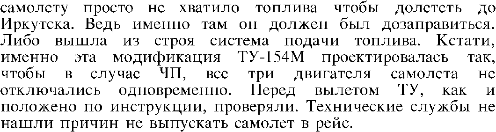

## Week 1 — Google Summer of Code 2018

Now the first week has started, I started to work on various aspects of the project. I started to research more on Scrolling Ticker Algorithm and also started did some other work which are as follows

### CWRU HPC Accounts
Every student working under Red Hen Labs is given a CWRU Account for High Performance Computing (HPC) which does the training of a model more speedily than a ordinary laptop. Our administrator Mark Turner asked some of the credentials and our RSA public keys. 
Our accounts had been made in a single day and also our credentials were given to login into CWRU cluster to work on.


```markdown

burhantwo@Burhan-Ubuntu:~$ ssh bxu22@redhen1.case.edu
Last login: Sun May 27 09:18:00 2018 from 103.255.7.30
bxu22@redhen1:~$ ssh bxu22@rider.case.edu
Last login: Sat May 19 06:53:44 2018 from redhen1.cosi.cwru.edu
[bxu22@hpc3 ~]$

```


### Problem and Installations
To solve the scrolling ticker problem, I used a modification of early fusion algorithm, basically what an early fusion algorithm does is, it check for changes in a ticker and a stopping point (which tells that one news has been finished and other has been started), if the changes are above some threshold value, it appends the ticker to a blank ticker otherwise it lets it go, it is very simple but powerful algorithm which can easily detect the changes in a ticker with upto 90% accuracy, to do the early fusion algorithm, I started needed to install OPENCV which is an open source Computer Vision Library. I needed to install OPENCV from source rather than install its pip version because pip version doesn’t support Video processing, so what I did was

```markdown
wget -O opencv.zip https://github.com/Itseez/opencv/archive/3.1.0.zip
unzip opencv.zip
```

This downloads OPENCV 3.1.0 and unzips it

Next I did was,

```markdown
wget -O opencv_contrib.zip https://github.com/Itseez/opencv_contrib/archive/3.1.0.zip
unzip opencv_contrib.zip
```

This downloads the extra modules associated with OPENCV 3.1.0 and unzips it. Next I installed Numpy

```markdown
pip install numpy
```
Finally, I installed OPENCV as

```markdown
cd ~/opencv-3.1.0/
mkdir build
cd build
cmake -D CMAKE_BUILD_TYPE=RELEASE \
-D CMAKE_INSTALL_PREFIX=/usr/local \
-D OPENCV_EXTRA_MODULES_PATH=~/opencv_contrib-3.1.0/modules \
-D BUILD_EXAMPLES=ON ..
make -j3 
sudo make install
sudo ldconfig
```

Now as OPENCV is installed, I’ll start working on implementing Scrolling Ticker Algorithm (Early Fusion Recognition) next week

Till Then

Cheers!!!!

## Google Summer of Code 2018 — Week 2

Now, I’m ending the week 2 of Google Summer of Code for Red Hen Labs, I’ll be writing my experiences and what I’ve done so far.

### Scrolling Ticker Algorithm (Early Fusion Recognition):

I had proposed Scrolling Ticker Algorithm (Early Fusion Recognition) as follows:


This algorithm checks for threshold and a stopper (which tells that a new news ticker has started), while taking in various inputs like ticker width, height, offset and speed, it then checks for threshold and if the ticker text is greater than that threshold (taken as 70), it appends that ticker to new ticker. With that we can easily detect different scrolling news with upto 90% accuracy. Nonetheless it also requires manual intervention because it takes various frames of same ticker and we have to manually specify which frame is most appropriate.

Since we don’t have the detector to detect Russian Text, I used the ticker co-ordinates to hard code the bounding box over the video region. I did so by

```markdown
cv2.rectangle(frame, (100, 525), (715, 550), (255,0,0), 2)
```

where frame is the exact video frame, x1 = 100, y1 = 525, x2 = 715 and y2 = 550.

After hardcoding the region and running the Scrolling Ticker Algorithm (Early Fusion), I got amazing results, some of which are


Since we are getting good results here, I’ll now rewrite the whole code in C as instructed to me by my mentor.

So next week, I’ll start working on writing its C code and also on integrating Tesseract API with Leptonica in it.

Until then

Cheers.

## Week 3 — Google Summer of Code

This is the end of week 3 for Google Summer of Code and I am writing what I have done. By the end of 2nd week, I have written the prototype for Scrolling Ticker Algorithm in Python. Now I have to rewrite it in C/C++ because of it’s integration in CCExtractor. So, I started researching on the OPENCV functions in C++.

The functions for OPENCV in C++ are quite different from the ones in Python. In C++, we have to manually set a lot of parameters in order for a function to work, while Python handles that automatically. For Example, in Python, we do the Morphology Transformation as

```markdown
closing = cv2.morphologyEx(thresh1, cv2.MORPH_CLOSE, kernel)
```
while in C++ as

```markdown
int morph_size = 2;
Mat element = getStructuringElement( MORPH_RECT, Size( 2*morph_size + 1, 2*morph_size+1 ), Point( morph_size, morph_size ) );
```

This makes the code re-writing a little bit complex, but it makes it more powerful.

Finally, all the code was rewritten with a little change which was that only those contours were selected (after pre-processing and running scolling ticker algorithm) which had an area between 150 and 300. This ensures that only stoppers are detected of scrolling news.

This is my work for week 3, I have done 1/3rd of my things I have proposed in my proposal (albeit, the second part of 1/3rd due to my mentor suggesting me to do it first). I have my exams during fourth week, so I will not do any work during fourth week. I’ll start the fifth week by integrating OCR into the Scrolling Ticker Algorithm.

Till Then,

Cheers

## Google Summer of Code 2018 — Week 4

I was unable to work during fourth week because of my exams. Because of that, I had already completed 1st part of my project (1/3rd of my proposal during third week). I'll now start working on integrating OCR into Scrolling Ticker Algorithm for Russian News.

## Google Summer of Code 2018 — Week 5

This is the end of week 5 and I’m writing my progress of what I’ve done it. The next step told to me by mentor after finishing with Scrolling Ticker Algorithm was integration of Tesseract OCR with CCExtractor. Because CCExtractor is written in C, we have to use C API for Tesseract in order for it to run. Also Scrolling Ticker is primarily written in OPENCV while CCExtractor doesn’t have OPENCV support on it so we have to configure it in Leptonica.

This week I configured C/C++ API of Tesseract and attached it with Scrolling Ticker Algorithm. Configuring C API was an easy task, we just had to adjust few libraries, and we had the working OCR for Russian Language.

The following were the results of OCR on a script on Russian Language.



```markdown
самолету просто не хватило топлива чтобы долстсть до
Иркутска. Ведь именно там он должен был дозаправиться.
Либо вышла из строя система подачи топлива. Кстати,
именно эта модификация ТУ-154М проектировалась так,
чтобы в случас ЧП, всс три двигателя самолста нс
отключались одновременно. Перед вылетом ТУ, как и
положено по инструкции, проверяли. Технические службы не
нашли причин не выпускать самолет В рейс.
```

Running that on tickers, we get:


```markdown
слгдітвиг попросило пгрдлшьігдст упюкдгвд до 15 Апгтй? пгісс-ату—жй
```

There are few errors but that is because of low quality of this image. Since we having working OCR for Russian Language, we will now integrate into CCExtractor.

Until Then,
Cheers!!!!

## Google Summer of Code 2018 — Week 6

This blogs tells my work and progress at the end of week 6. So week 5 ended with configuring Tesseract OCR for Russian Language. Week 6 started with the goal in mind that now we have to integrate all of our existing algorithms in CCExtractor. For that we have to first read the frames in FFMPEG, since OPENCV is not supported in CCExtractor. Since working in C is quite fun, I started to read the FFMPEG documentation and started to work on it. I also have reused the previous work done by my mentor Abhinav Shukla in CCExtractor previous year. After some time, I was able to read RGB Frames using FFMPEG. Next, I had to do the basic pre-processing to extract the tickers out of the frames. Unlike before, we used hardcoded parameters to extract the tickers, I found a method implemented by mentor which checks every pixel in a frame and if that pixel is greater than threshold, it becomes White, otherwise it becomes black, re adjusting the parameters, we get a pretty awesome image here


Next, we run the Tesseract OCR onto it and we get the results:

```markdown
(“ОДИН )КСТРЕНАПЬНЫЕ КОЛОДА В (ТОПИЧlНОН РЕГИОНЕ ОКТУПАЮТ (“от
ст н—А * 7 ‹ ^ .
```

The results are pretty convincing considering the fact that it is a low resolution image, we have to now work on correcting the results a little more and handling frames (implementing of Scrolling Ticker Algorithm and Late Fusion).

Until Then

Cheers!!!!

## Google Summer of Code 2018 — Week 7 & 8

This blog tells us of my work done during Week 7 and 8. During my 2nd week, I’ve implemented Scrolling Ticker Algorithm in Python with OPENCV. Scrolling Ticker Algorithm is as follows:


The challenge was to implement in C without OPENCV and using just Leptonica. I used FFMPEG to read the frames from the video, next I found a good workaround done by my mentor Abhinav Shukla when he was working with CCExtractor. He proposed that the RGB Colors of individual pixels of the frame be converted CIE-LAB color space to get the Luminance. If Luminance is greater than a threshold (taken as 85) then all of the pixels are converted into White (255) otherwise it is converted into Black (0). Next we use necessary steps to create to do the threshold to the image. The following is the end result


Since, the result is quite good, we then manually define a bounding box to cut the image. The result would be


The original image would look something like this:


Here the stoppers are of blue color, we detect the blue stoppers by getting the RGB color of each pixel and if stopper is present, then it checks for the next stopper (until then frames are skipped), when the next stopper arrives, we define that whole stream as single ticker and save it and run the Tesseract Russian OCR onto it, the end result for thresholded image would be:


```markdown
слгдітвиг попросило пгрдлшьігдст упюкдгвд до 15 Апгтй? пгісс-ату—жй
```

The results are pretty good, the small errors are due to bad quality of the images. This way we get pretty good results from Early Fusion (Scrolling Ticker Algorithm)

Late Fusion Algorithm:

In late fusion algorithm, we check the repetition of the words in incoming frames. I have put a threshold of a least 5 words, meaning if 5 words are repeated then that means that they are the same words from last frame and need to be skipped. It is quite efficient than early fusion algorithm but is quite slow and thus is used for post processing.


## Google Summer of Code 2018 — Week 9 & 10

This blog tells about the work I’ve done during my 10th week, so after passing the second phase of GSoC’18 during the 9th week, I started to work on integrating the stitching algorithm into the main code, this was quite a challenge because the main code needed to changed in order for stitching algorithm to fit onto that correctly. This is because the stitching algorithm just takes the two images given previously by Scrolling Ticker Algorithm and stitches them, since scrolling ticker algorithm checks for the stoppers in a ticker, it doesn’t care if the stopper is occurring in the middle, it just sends the data to the stitching algorithm.

So, a new change was introduced to avoid the duplication done by scrolling ticker algorithm, which was checking that if the last second frame is equal to current frame, we neglect that.

This way we ensure, that we get the perfect tickers to stitch.

Here are some the results


There seems to be a problem in the last result but it is not, since we are working of find unique tickers, the last ticker is the continuation of second last ticker and it is unique so we can count that.

Since, I’ve integrated it onto the main code, now I have to integrate that into CCExtractor code

Until then
Cheers


